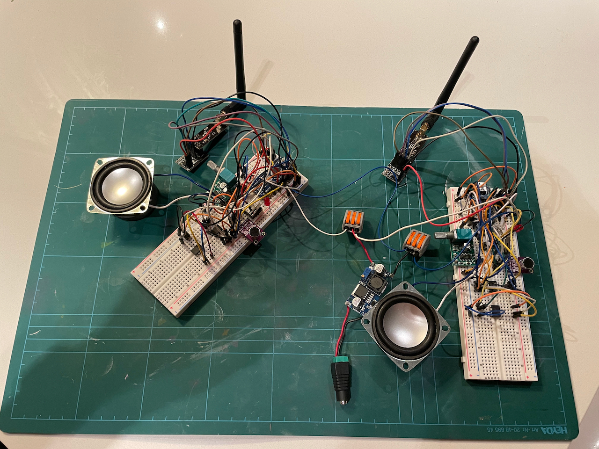

WalkieTalkie
============
This project started out as a simple Walkie Talkie implementation using an ATmega328 platform (Arduino Nano in my case). However over the course of a few weeks it turned into a detailed exploration of various topics:

  - Efficient use of timer interrupts for audio handling (both recording and playback)
  - Analog to Digital conversion using ATmega328's internal ADC
  - Digital to Analog conversion using an external chip (MCP4921)
  - Using an op-amp chip for audio output and volume control (PAM8403)
  - Managing transient memory in an external chip (23LCV1024)

Arduino application works as follows:

  - Listens on incoming transmissions and button events
  - If playback button is pressed, plays from memory chip at 9.6kHz
  - If transmit button is pressed, begins recording using ADC at 9.6kHz
  - Once transmit button is released, broadcasts recorded audio on the radio channel
  - If there is incoming data, wipes memory and writes audio into RAM

